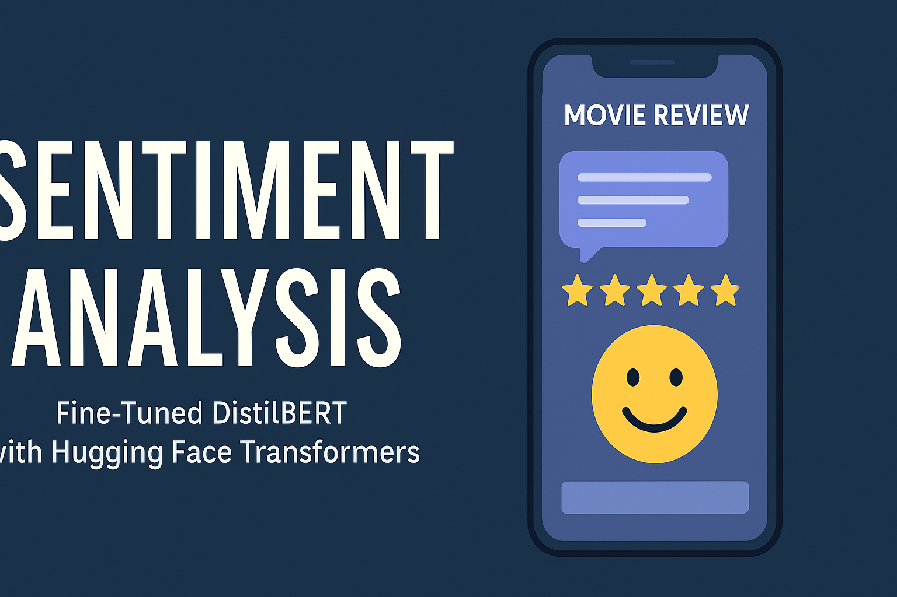

<p align="center">
  
</p>


## 🚀 Getting Started

Follow these steps to set up and run the sentiment analysis project locally:

### 1️⃣ Clone the Repository

```bash
git clone https://github.com/seiifff/distilbert-sentiment-analysis1.git
cd distilbert-sentiment-analysis1
```

### 2️⃣ Install Dependencies

Make sure you have Python 3.8+ and run:

```bash
pip install -r requirements.txt
```

### 3️⃣ Download or Train the Model

If you have not already saved the model:

```python
# Run in notebook or Python shell after training
import torch
torch.save(model.state_dict(), "sentiment_model.pth")
```

Make sure `sentiment_model.pth` is in the project root directory.

### 4️⃣ Run the Gradio App

```bash
python gradio_sentiment_app.py
```

Once running, Gradio will give you a local and public URL to access the web interface.

---

## 🧪 Example

Try entering:

```
This movie was surprisingly good, with great acting and a powerful script.
```

Expected Output:

```
Positive 😊
```


---

## 🔗 Connect with Me

- [LinkedIn](https://www.linkedin.com/in/seif-ferooz/)
- [GitHub Portfolio](https://github.com/seiifff)

